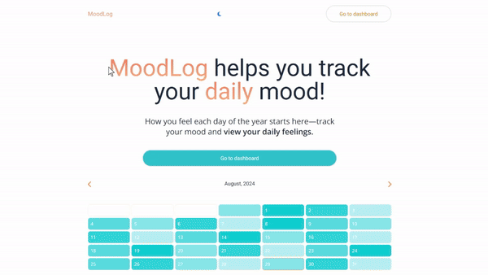

# MoodLog

MoodLog is a web application designed to help you monitor and reflect on your daily mood throughout the entire year. It provides a user-friendly interface to log your mood, view past entries, and gain insights into your emotional patterns.

## Features

- **Daily Mood Logging**: Easily log your mood every day with a simple and intuitive interface.
- **Theme Toggle**: Switch between light and dark themes based on your preference or system settings.
- **User Authentication**: Secure login and logout functionality to keep your data private.
- **Responsive Design**: Optimized for both desktop and mobile devices.
- **Font Customization**: Uses Google Fonts for a clean and modern look.

## Technologies Used

- **JavaScript**
- **React**
- **Next.js**
- **Tailwind CSS**
- **Font Awesome** for icons
- **Google Fonts** for typography

## Getting Started

### Prerequisites

- Node.js
- npm (Node Package Manager)

### Installation

1. Clone the repository:
    ```bash
    git clone https://github.com/PratikPaudel/moodlog.git
    cd moodlog
    ```

2. Install the dependencies:
    ```bash
    npm install
    ```

3. Run the development server:
    ```bash
    npm run dev
    ```

4. Open your browser and navigate to `http://localhost:3000`.

## Usage

- **Log Mood**: Navigate to the homepage and log your mood for the day.
- **Toggle Theme**: Use the theme toggle button in the header to switch between light and dark modes.
- **Logout**: Click the logout button in the header to securely log out of your account.

## Live Site

Check out the live site at [MoodLog](https://moodlog-chi.vercel.app).

## Demo



## Contributing

Contributions are welcome! Please fork the repository and submit a pull request for any improvements or bug fixes.

## License

This project is licensed under the MIT License. See the `LICENSE` file for more details.

## Acknowledgements

- Built by Pratik 💛
- Inspired by the need for better mental health tracking and reflection.